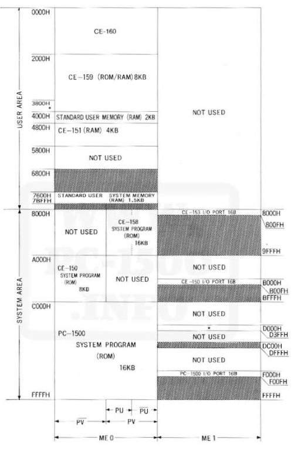
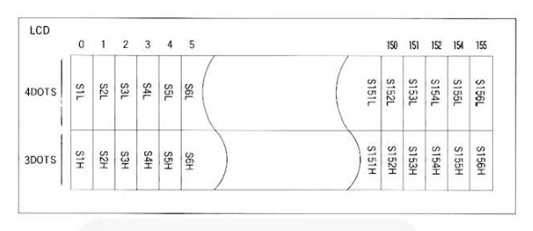
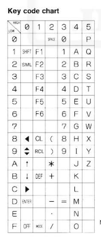
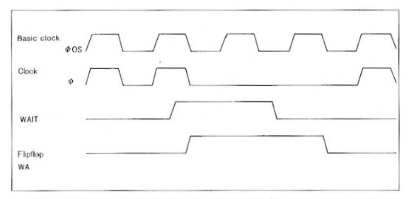

## Arquitectura interna del SHARP PC-1500

La SHARP PC-1500 representa uno de los avances más destacados en la historia de los ordenadores de bolsillo, combinando portabilidad, capacidad de programación y una arquitectura avanzada para su época. El diseño interno del ordenador fue concebido para proporcionar una experiencia de usuario intuitiva, sin dejar atrás la potencia y versatilidad de los dispositivos del momento. El resultado final es una calculadora científica que permite la ejecución de programas complejos y la interacción directa con el hardware. Este capítulo describe en profundidad los principales componentes arquitectónicos del sistema, su funcionamiento.

### 2. El procesador LH5801

El corazón de la PC-1500 es el microprocesador LH5801, desarrollado específicamente por Sharp. Este procesador de 8 bits dispone de un bus de direcciones de 16 bits que le permite acceder a hasta 64 KB de espacio de memoria. El conjunto de instrucciones del LH5801 está optimizado para operaciones aritméticas, lógicas y de control, lo que lo hace ideal para la interpretación de código BASIC y la gestión de periféricos.

#### 2.1 Registros del Procesador

El preocesador, pese a ser muy versátil, no dispone de nada más que tres registros de propósito general. El listado de Registros y flipflops es el siguiente:

- **P**: encargado de almacenar el contador de programa (16 bits)
- **S**: encargado de almacenar el contador de pila (16 bits)
- **X, Y, U**: tres registros de propósito general (16 bits)
- **A**: registro acumulador usado para almacenar los resultados de operaciones (8 bits)
- **T**: contador de tiempo con 9 bits, el primero indica si el contador está parado o activo. Cuando todos los 8 bits restantes llegan a "1" la CPU ejecuta un proceso de interrupción. (9 bits)
- **PU, PV**: flipflips de propósito general (1 bit)
- **DISP**: flipflop que controla el display LCD (1 bit)
- **T**: registro de estado, guarda la información de los 5 flags de estado posibles (8 bits)

#### 2.2 Flags de estado

Los 5 bits menos significativos del registro de estado T representan los estados posibles tras los resultados de las distintas operaciones. En orden de menos a más significativo el bit se listan:

- **C**: se activa (se pone a 1) cuando, al realizar una operación aritmética, ocurre un acarreo desde el bit más significativo (MSB). Se desactiva (se pone a 0) cuando no hay acarreo. En operaciones de sustracción (*SUBTRACT*), la bandera C se activa si no hay préstamo (borrow) y se desactiva si hay préstamo.

- **IE**: esta señal no depende de los resultados de las operaciones como el resto. Al activarse, permite el manejo de interrupciones por parte del procesador.

- **H**: se activa cuando hay un acarreo desde el bit 3 durante una operación aritmética, es decir, cuando ocurre un acarreo en la suma de dígitos (digit-to-digit carry). Se desactiva cuando no ocurre tal acarreo.

- **Z**: se activa cuando el resultado de una operación es cero. Se desactiva si el resultado es distinto de cero.

- **V**: indica si se ha producido un desbordamiento en una operación aritmética. Se activa o desactiva dependiendo del resultado de la operación, considerando el acarreo desde el bit 6 y el bit 7 de un dato de un solo byte. El desbordamiento se detecta si el acarreo desde el bit 6 (C6) y el acarreo desde el bit 7 (C7) son diferentes.

### 3. Arquitectura de memoria

La memoria de la PC-1500 está segmentada en diferentes áreas, cada una con una función específica:

- **ROM:** La memoria ROM contiene el firmware esencial del dispositivo, incluyendo el intérprete BASIC y las rutinas de sistema. En su configuración estándar, la PC-1500 integra 16 KB de ROM, aunque este valor puede variar según la versión y los módulos instalados.

- **RAM:** La memoria RAM está destinada al almacenamiento de programas y datos del usuario. La cantidad base es de 3.5 KB, ampliable mediante módulos externos que se conectan en los slots de expansión disponibles. Esta capacidad de ampliación es una característica clave, ya que permite adaptar el dispositivo a las necesidades del usuario.

- **Expansión:** Además de los módulos de RAM, es posible añadir módulos de ROM y otros periféricos, ampliando la funcionalidad y el espacio de almacenamiento del sistema.

La gestión de la memoria se realiza a través de registros de control que permiten seleccionar dinámicamente los bancos de memoria activos y gestionar el acceso a los periféricos, lo que optimiza el uso de los recursos internos y externos.

### 4. Pantalla LCD y presentación de datos

La PC-1500 incorpora una pantalla LCD monocroma, que fue un avance significativo en el momento de su lanzamiento. Esta pantalla cuenta con una resolución de 156 x 7 puntos y es capaz de mostrar hasta 26 caracteres alfanuméricos en una única línea. Aunque la capacidad gráfica es limitada, el controlador de pantalla permite la manipulación directa de píxeles y caracteres, lo que facilita la creación de interfaces simples y la visualización de datos calculados.

El usuario puede interactuar con la pantalla mediante comandos BASIC, así como mediante instrucciones en código máquina, accediendo a registros específicos del controlador de pantalla.

### 5. Teclado y entrada de datos

El teclado de la PC-1500 está formado por 65 teclas, incluyendo teclas alfanuméricas, de función y de control. El diseño del teclado está pensado para permitir tanto la entrada de datos como la programación directa del dispositivo. Teclas como RUN, STOP y SHIFT ofrecen acceso rápido a funciones esenciales y modificadores, facilitando la interacción en tiempo real con el sistema.

La detección de pulsaciones se realiza mediante un escaneo electrónico, con el procesador supervisando continuamente el estado del teclado a través de registros dedicados. Esto permite una respuesta eficiente y una gestión precisa de las entradas.

### 6. Subsistema de entrada/salida y conectividad

Una de las características distintivas de la PC-1500 es su capacidad para comunicarse con dispositivos externos. El procesador LH5801 gestiona los periféricos mediante instrucciones específicas, accediendo a registros y líneas de control.

El sistema cuenta con varios puertos de entrada/salida:

- **Interfaz serie:** Permite la conexión a impresoras, grabadoras de cinta y otros periféricos, facilitando la transferencia y almacenamiento de datos.

- **Bus de expansión:** A través de este bus es posible conectar módulos de memoria, interfaces adicionales y otros dispositivos, ampliando notablemente las posibilidades del ordenador de bolsillo. La interfaz CE-158X, utilizada para extraer la ROM de la máquina, se conecta a través de este bus de expansión.

- **Puerto de cassette:** Diseñado para el almacenamiento y recuperación de datos en cinta magnética, una solución común en la época.

La arquitectura de entrada/salida está gestionada mediante instrucciones específicas y registros de control, permitiendo al usuario interactuar con los periféricos desde el propio lenguaje BASIC o mediante rutinas en ensamblador.

### 7. Temporización y control de eventos

El sistema de temporización de la PC-1500 se basa en un circuito que proporciona una frecuencia de operación de 2.6 MHz (que se divide dentro de la CPU la cual funciona a 1,3 MHz). Esta señal de reloj es utilizada tanto por el procesador como por los periféricos, garantizando la sincronización de todas las operaciones internas.

Además, el sistema incluye líneas de interrupción que permiten al procesador atender eventos externos y temporizados. Esto es esencial para la gestión eficiente de la entrada por teclado, la comunicación con periféricos y la ejecución de rutinas de temporización.

### 8. Alimentación y gestión energética

La PC-1500 está diseñada para funcionar con baterías tipo AA, lo que garantiza su portabilidad y uso prolongado sin necesidad de conexión a la red eléctrica. El sistema incluye mecanismos de gestión de energía, como el apagado automático y la optimización del consumo, permitiendo maximizar la autonomía del dispositivo.

El usuario puede optar también por un adaptador externo, permitiendo el uso intensivo del sistema sin preocupaciones por la duración de la batería.
