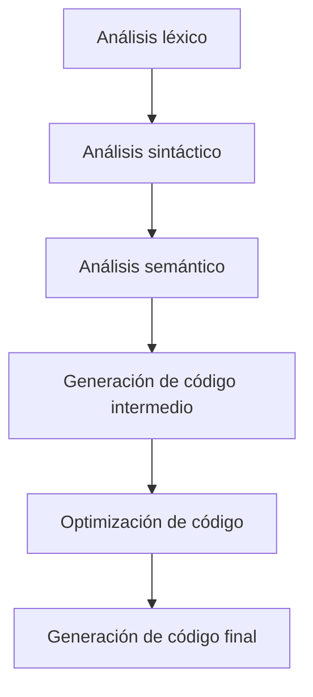

## **Principios de diseño de compiladores**

El diseño de un compilador implica transformar un programa escrito en un lenguaje fuente de alto nivel en un programa equivalente en lenguaje de destino (generalmente código máquina o bytecode). Las principales fases del diseño de compiladores son:

### **Frontend (Análisis)**

#### 1. **Análisis léxico**
El compilador divide el código fuente en unidades sintácticas mínimas llamadas *tokens* (identificadores, palabras reservadas, operadores, constantes). Se eliminan los espacios en blanco y los comentarios para identificar y clasificar individualmente los elementos léxicos.

**Ejemplo:**  
En el código `A = B + 1`, los tokens serían: `A`, `=`, `B`, `+`, `1`.

#### 2. **Análisis sintáctico**
El analizador sintáctico construye una estructura jerárquica (árbol sintáctico o *parse tree*) que representa la organización gramatical del código fuente, comprobando que los tokens siguen las reglas gramaticales del lenguaje. Aqui podemos detectar errores sintacticos correspondinetes al lenguaje procesado y ordenar en secuencia las operaciones a realizar.

#### 3. **Análisis semántico**
Esta fase verifica que las construcciones sintácticas tienen sentido en términos de significado (semántica). Comprueba que las variables están declaradas antes de usarse, que los tipos de datos son compatibles, analisis de flujo de control y resuelve los identificadores. 

#### 4. **Generación de código intermedio**
Se traduce el árbol sintáctico en un formato intermedio independiente de la máquina, que facilita la optimización y la posterior generación de código final. Esta debe ser portable para diferentes arquitecturas y lo más eficiente posible.

### **Backend (Síntesis)**

#### 5. **Optimización de código**
El código intermedio se mejora para aumentar la eficiencia.Utiliza técnicas como la eliminación de expresiones redundantes, la propagación de constantes o el analisis de variables vivas; sin alterar el comportamiento del programa.

#### 6. **Generación de código final**
Se transforma el código intermedio optimizado en el lenguaje de destino (máquina, ensamblador, bytecode). Este código es ejecutable y está preparado para las características del hardware de la máquina destino

### **Gestión de errores**
El compilador debe detectar, informar y, en lo posible, recuperar de errores proporcionando mensajes útiles al usuario. Los errores que debemos manejar:

- Léxicos: carácteres no validos.
- Sintácticos: estructuras incorrectas.
- Semnánticos: tipos incompatibles, variables no declaradas.
- De enlace: referencias no resueltas.

Para reportar errores se debe usar mensajes claros, concisos y específicos; informar de la ubicación (línea, columna) y sugerir una corrección siempre que sea posible.

### **Gestión de símbolos y tablas**
Durante el proceso, el compilador utiliza tablas de símbolos para registrar información sobre variables, funciones, tipos, nombres de símbolos, ámbitos, direcciones de memoria y atributos adicionales.

---

### **Resumen visual del flujo de un compilador**

---

### **Consideraciones de diseño**

- **Modularidad:** Separar claramente cada fase del compilador para facilitar el mantenimiento y la extensión.
- **Portabilidad:** Usar representaciones intermedias para poder adaptar el compilador a diferentes arquitecturas.
- **Eficiencia:** Buscar algoritmos y estructuras de datos eficientes para minimizar el tiempo de compilación y la generación de código óptimo.
- **Extensibilidad:** Permitir la incorporación de nuevas características o lenguajes fuente de manera sencilla.